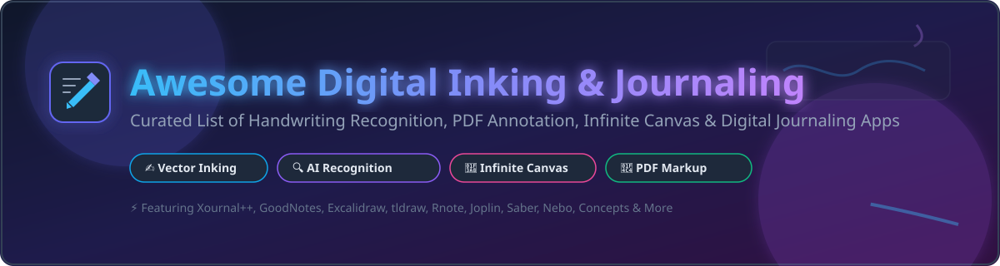

# Awesome Digital Inking & Journaling 🖋️📑

  

  
  
  
  
  

> 🌟 **A curated list of commercial SaaS products & open-source software for digital inking, handwriting recognition, PDF markup, infinite canvas sketching, and stylus journaling.**

**Last updated: October 2026** 📅

---

## 🎯 Overview & Introduction

This repository tracks top-tier **commercial apps** and **open-source software** for **Digital Inking, Stylus Note-Taking & Journaling**. These tools empower users to write, sketch, diagram, and annotate by hand on tablets, iPads, touchscreen convertibles, and stylus hardware—combining the natural tactile feel of pen and paper with digital features like OCR search, cloud synchronization, vector drawing, and PDF annotation.

- **Key Software Categories**: Digital Inking Apps, PDF Annotators, Infinite Canvas Sketchbooks, Stylus Journaling Tools, Handwriting-to-Text OCR Engines.
- **Popular Examples**: Microsoft Journal, GoodNotes, Notability, Nebo, OneNote, Penbook, Noteful, Concepts, Paper by WeTransfer, and Noted.
- **Open-Source Highlights**: High-performance open-source handwriting apps such as **Excalidraw**, **tldraw**, **Joplin**, **Xournal++**, **Rnote**, **Saber**, and **Linwood Butterfly**.

---

## 📖 Table of Contents

- [💼 Commercial Apps & SaaS Products](#-commercial-apps--saas-products)
- [🔓 Open-Source GitHub Projects](#-open-source-github-projects)
- [🤝 How to Contribute](#-how-to-contribute)
- [💖 Support & Sponsorship](#-support--sponsorship)
- [📈 Star History](#-star-history)
- [⚠️ Disclaimer](#%EF%B8%8F-disclaimer)

---

## 💼 Commercial Apps & SaaS Products

> 📊 **Market Context & Size**: The global digital note-taking and inking software market is estimated at **~$1.8 Billion - $2.4 Billion (2025/2026)** with an estimated compound annual growth rate (CAGR) of **~14.5%**. The sector is **moderately fragmented** overall but **highly concentrated on Apple iOS/iPadOS ecosystems** where premium apps like GoodNotes and Notability dominate. Across Windows and Android platforms, the market is fragmented between pre-installed ecosystem tools (Microsoft OneNote, Samsung Notes) and specialized cross-platform drawing/inking suites. No single vendor holds a winner-take-all monopoly across all desktop and mobile platforms.

### 📊 SaaS Products & Commercial Apps Comparison

*Sorted by Company Size / Revenue / Market Capitalization (Descending)* ⬇️

| App 📱 | Description 📝 | Pricing (Starting Tier) 💵 | Free Tier / Trial Limits 🆓 | Company Size / Valuation 🏛️ |
|---|---|---|---|---|
| **[Microsoft OneNote](https://www.microsoft.com/en-us/microsoft-365/onenote/digital-note-taking-app)** | **Microsoft's free-form note app with rich digital inking.** Cross-platform stylus input on Windows, iPad, and Android. | **$6.99/mo** (Microsoft 365 Personal) | **Unlimited Free Plan** (Free basic account with 5 GB OneDrive storage). | **~$281B Annual Revenue** (Microsoft FY2025) |
| **[Microsoft Journal](https://www.microsoft.com/en-us/p/journal/9nblggh4qghw)** | **Free Windows pen-first inking app.** Ink gestures, lasso selection, AI page organization. | **Free** (Pre-installed / Store App on Windows 10/11) | **Unlimited Free Plan** (Completely free for Windows 10/11 users). | **~$281B Annual Revenue** (Microsoft FY2025) |
| **[Paper by WeTransfer](https://paper.bywetransfer.com/)** | **Minimalist sketching and journaling app.** Beautiful ink rendering and tools on an intuitive canvas. | **$11.99/mo** (WeTransfer Pro tier) or $6.99/mo Paper Pro | **Free Tier**: Limited to basic journaling tools and 1 journal book. | **~$1.5B Market Valuation** (WeTransfer / Bending Spoons) |
| **[GoodNotes](https://www.goodnotes.com/)** | **The market-leading iPad digital notebook.** Fluid digital ink, AI handwriting OCR, and cross-platform sync. | **$9.99/year** subscription or $29.99 one-time purchase | **Free Tier**: Limited to 3 digital notebooks with basic ink tools. | **~$200M+ Valuation** (Private / Bootstrapped Leader) |
| **[Notability](https://www.gingerlabs.com/)** | **Audio-synchronized note-taking for iPad & Mac.** Record lectures while writing; tap ink to replay audio. | **$14.99/year** (Notability Plus plan) | **Free Tier**: Limited edit quota per month & basic templates. | **~$100M+ Estimated Valuation** (Ginger Labs / Private) |
| **[Concepts](https://concepts.app/)** | **Infinite canvas sketching and vector design.** Infinite canvas for visual ideation, CAD, and note-taking. | **$4.99/mo** or $29.99/year (Concepts Everything) | **Free Tier**: Basic infinite canvas with 5 vector layers & standard pens. | **Private / VC-backed** (TopHatch Inc.) |
| **[Nebo](https://www.nebo.app/)** | **Interactive ink & handwriting-to-text converter.** Write by hand and convert to typed text instantly. | **$8.99** (One-time full app pack purchase) | **Free Tier**: Limited to 1 notebook page; paid upgrade for unlimited. | **Private / Enterprise Leader** (MyScript / Vision Objects) |
| **[Penbook](https://www.penbookapp.com/)** | **Digital paper journal for iPad & Windows.** 400+ custom stationery backgrounds and tactile ink options. | **$14.99/year** or $49.99 lifetime purchase | **Free Tier**: Access to standard paper styles & 1 active notebook. | **Private Bootstrapped** (UserGrid Inc.) |
| **[Noteful](https://www.noteful.com/)** | **Layer-based handwriting app for iPad.** Multi-layer note-taking, vector ink, and PDF markup. | **$4.99** (One-time Pro purchase on App Store) | **Free Tier**: Up to 10 notebooks and basic layer capabilities. | **Private Independent** (Noteful Studio) |
| **[Noted](https://www.notedapp.io/)** | **Audio-first note-taking and transcription app.** Synchronized timestamps, ink notes, and dictation. | **$2.49/mo** or $14.99/year (Noted+ Subscription) | **Free Tier**: Up to 5 notes and 15 minutes of audio recording per note. | **Private Bootstrapped** (Diamond Assets Ltd) |

---

## 🔓 Open-Source GitHub Projects

> 💡 **Open-Source Advantage**: The open-source digital inking ecosystem features production-proven, cross-platform apps built in C++, Rust, Flutter, and Web technologies. They offer full offline privacy, custom encryption, local file ownership, and zero monthly subscriptions.

### 🌟 Open-Source Repositories Comparison

*Sorted by GitHub Star Count (Descending)* ⬇️

| Repo / Project 📦 | Description 📝 | GitHub Stars ⭐️ | License 📜 |
|---|---|---|---|
| **[Excalidraw](https://github.com/excalidraw/excalidraw)** | **Virtual whiteboard for sketching hand-drawn like diagrams.** Infinite canvas, real-time collaboration, end-to-end encryption, and customizable stylus/mouse stroke rendering. |  **133,500+** | **MIT** |
| **[Joplin](https://github.com/laurent22/joplin)** | **Privacy-focused, cross-platform note-taking app.** End-to-end encryption, handwriting & drawing attachments, markdown support, and Nextcloud/WebDAV sync. |  **56,500+** | **AGPL-3.0** |
| **[tldraw](https://github.com/tldraw/tldraw)** | **Infinite canvas drawing and digital note-taking library.** Modern web canvas with smart pen interactions, shape recognition, and collaborative ink canvas. |  **50,700+** | **Apache-2.0 / PolyForm** |
| **[Logseq](https://github.com/logseq/logseq)** | **Local-first, privacy-first knowledge base.** PDF annotation, whiteboards, handwritten canvas, and markdown outliner. |  **45,100+** | **AGPL-3.0** |
| **[Xournal++](https://github.com/xournalpp/xournalpp)** | **Definitive open-source handwritten note-taking & PDF annotation app.** Written in C++/GTK3 with pressure-sensitive stylus support (Wacom, Huion), audio recording synced to ink strokes, LaTeX math typesetting, and Lua scripting plugins. |  **15,400+** | **GPL-2.0** |
| **[Rnote](https://github.com/flxzt/rnote)** | **Vector-based handwritten note-taking app with infinite canvas.** Written in Rust & GTK4, featuring adaptive stylus UI, continuous vertical layout, SVG/PDF import and export, and pen audio feedback. |  **11,700+** | **GPL-3.0** |
| **[Lorien](https://github.com/mbrlabs/Lorien)** | **Infinite canvas drawing and note-taking application.** Built with Godot Engine, fast performance, vector strokes, and dark/light themes. |  **6,800+** | **MIT** |
| **[Saber](https://github.com/saber-notes/saber)** | **Cross-platform handwritten notes app built with Flutter.** Features dark-mode ink inversion, dual-password encryption, self-hostable synchronization, and multi-line highlighter compositing. |  **4,800+** | **GPL-3.0** |
| **[OpenBoard](https://github.com/OpenBoard-org/OpenBoard)** | **Cross-platform interactive whiteboard application for schools and universities.** Designed for stylus tablets, interactive displays, PDF markup, and classroom presentations. |  **3,000+** | **GPL-3.0** |
| **[Linwood Butterfly](https://github.com/LinwoodCloud/Butterfly)** | **Minimalistic open-source note-taking app with infinite canvas.** Cross-platform (Android, Windows, Linux, Web), WebDAV sync, and stylus input. |  **2,000+** | **GPL-3.0** |
| **[Scrivano](https://github.com/TeXlyre/Scrivano)** | **Handwriting and PDF annotation tool.** Designed for stylus input, grid snapping, and paper layout customization. |  **500+** | **GPL-3.0** |
| **[SimpleJournal](https://github.com/andyld97/SimpleJournal)** | **Windows WPF note-taking program for convertibles & tablets.** Features palm rejection disable-touch, Ghostscript PDF support, and page templates. |  **200+** | **GPL-3.0** |
| **[Agaric](https://github.com/jfolcini/agaric)** | **Local-first block journaling app with Rust backend.** Peer-to-peer sync, tags, backlinks, and Mermaid diagrams. |  **10+** | **GPL-3.0** |

---

## 🤝 How to Contribute

Contributions are welcome! Please follow these simple steps:

1. 🍴 **Fork** this repository.
2. ➕ **Add/Edit** entries in `README.md` following the table formatting.
3. 📝 **Include** name, repository/website link, concise description, license, and starting pricing details.
4. 🚀 **Submit a Pull Request** with a clear explanation of your additions.

---

## 💖 Support & Sponsorship

If you find this curated list valuable for finding digital inking tools, note-taking software, or open-source tablet apps, please consider supporting this project!

- ⭐️ **Star this repository** to help others discover it.
- 🔄 **Share it** with fellow students, researchers, and stylus enthusiasts.
- ☕ **Sponsor the Maintainer**: Buy me a coffee via [GitHub Sponsors Dashboard](https://github.com/sponsors/ishandutta2007).

Thank you for your encouragement and support! 🙌

---

## 📈 Star History

---

## ⚠️ Disclaimer

- This list is **community-curated** for educational and informational purposes.
- Digital inking apps process personal notes, signatures, and confidential documents; always verify encryption and cloud privacy settings prior to deployment.
- Product details, market capitalizations, and software pricing are accurate as of **October 2026**.

---

  <b>Made with ❤️ for students, researchers, digital journalers, and stylus creators.</b>

